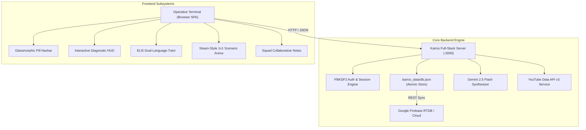

# KAIROS // AI-Driven Cybersecurity Skill Mastery Engine

[](https://nodejs.org/)
[](https://ai.google.dev/)
[](https://firebase.google.com/)
[](https://github.com/anubhavmohandas/Kairos)
[](https://github.com/anubhavmohandas/Kairos)
[](LICENSE)

**KAIROS** is a full-stack, AI-augmented cybersecurity skill mastery engine. It replaces passive video lectures and dry multiple-choice quizzes with real-world attacker/defender scenario simulations, surgical skill-gap remediation, context-aware AI tutoring in English and native Hinglish, and collaborative squad telemetry.

---

## Architecture & System Overview



---

## Key Features

### 1. Authentic Diagnostic Triage HUD
- **Terminal Evidence Inspection**: Realistic terminal window with macOS/Linux control dots, copy-to-clipboard functionality, and high-contrast monospace audit logs.
- **Active Directory Kerberoasting Suite**:
  - **Scenario 01**: SPN Enumeration & Service Account Discovery (`setspn.exe -T medtech.local -Q */*`).
  - **Scenario 02**: Kerberos Cipher Downgrades (`0x17` RC4-HMAC vs `0x12` AES-256 in Rubeus).
  - **Scenario 03**: Offline Hashcat Decryption & Account Lockout Policy Bypass (`hashcat -m 13100`).
  - **Scenario 04**: Windows Event ID 4769 Threat Hunting in SIEM (Splunk / Microsoft Sentinel).
  - **Scenario 05**: Enterprise Remediation via Group Managed Service Accounts (gMSAs).
- **Dual-Language Mental Models**: Every scenario features an EL10 ("Explain Like I'm 10") intuition model, "So What?" blast-radius impact, and surgical cheat sheets in both **English** and **Hinglish**.

### 2. 100% Dynamic AI Scenario Synthesis
- Powered by **Google Gemini 2.5 Flash**.
- Operatives can type *any* technical or niche topic (e.g., `Kubernetes ServiceAccount Token Theft`, `Smart Contract Reentrancy`, `OAuth2 Redirect Hijacking`), and the backend dynamically synthesizes a complete scenario diagnostic suite with realistic technical telemetry in milliseconds.

### 3. Cryptographic Security & Database Architecture
- **PBKDF2 Hashing**: Cryptographic password hashing using `crypto.pbkdf2Sync` with 10,000 iterations, 64-byte key length, `sha512`, and 16-byte random salts.
- **Legacy Fallback**: Transparent `sha256_legacy` compatibility ensures existing accounts authenticate without interruption.
- **Persistent Sessions**: Sessions backed by `db.json` with 7-day TTL timestamps, surviving server restarts.
- **Atomic Persistence**: Database saves via `.tmp` temporary files followed by `fs.renameSync` to eliminate corruption.
- **Cloud Database Synchronization**: Live background synchronization with Google Firebase Realtime Database (`kairos-avdv`).
- **Strict Security Headers**: Automatic injection of `X-Frame-Options: DENY`, `X-Content-Type-Options: nosniff`, `X-XSS-Protection`, and `Referrer-Policy`.

### 4. Interactive ELI5 Tutor
- Floating, dockable AI cyber mentor that maintains scenario context.
- Explains intricate concepts (e.g., Kerberos tickets, SPF/DKIM/DMARC records, Evilginx reverse proxies) using intuitive real-world metaphors (such as bank vaults vs bicycle locks).

### 5. Steam-Style Peer Learning & 1v1 Arena
- **Live Presence Stream**: Real-time ticker broadcasting squad peer promotions, diagnostic completions, and level-ups.
- **1v1 Scenario Arena**: Timed 60-second speed scenario duels against bots and peers.
- **Squad Collaborative Notes**: Verified exam tips and attack vectors shared within squads (`ZeroDay Hunters`, `RedTeam Alpha`, `CyberSentinels`, `CloudGuard`) with anti-cheat upvoting.

### 6. Neo-Brutalist HUD Design System
- **100% Bespoke SVG Vector Icons**: Zero system emojis across the entire platform.
- **Translucent Glassmorphism Navbar**: `1420px` extended width with `backdrop-filter: blur(18px) saturate(190%)`.
- **Operative Profile Dossier**: Positioned at the far right of the HUD with working session logout, squad switching, and career telemetry stats.
- **Dark / Light High-Contrast Accessibility**: Explicit green (`#052e16`) and red (`#450a0a`) card palettes ensuring zero unreadable text in dark mode.

---

## Tech Stack

| Layer | Technology |
|---|---|
| **Frontend** | Vanilla JavaScript (ES Modules), HTML5, CSS3 Variables, Web Audio API |
| **Styling** | Neo-Brutalist Design System, Glassmorphism, Responsive Media Queries |
| **Vector Assets** | 100% Custom SVG Vector Icons (0 Emojis) |
| **Backend** | Node.js native HTTP server, Crypto, FileSystem |
| **Database** | Persistent JSON Store with atomic rename, Google Firebase Cloud DB |
| **AI Synthesis** | Google Gemini 2.5 Flash API via `@google/genai` |
| **Video Engine** | YouTube Data API v3 with curated fallback search index |
| **Build Tool** | Vite 6 |

---

## Project Structure

```text
Kairos/
├── index.html                 # Main application single-page container
├── package.json               # Scripts and dependency specifications
├── vite.config.js             # Vite configuration
├── .env.example               # Environment variable configuration template
├── server/
│   ├── server.js              # REST API HTTP server and static file provider
│   ├── db.js                  # PBKDF2 database engine with persistent sessions
│   └── services/
│       ├── firebaseBackend.js # Google Firebase RTDB cloud sync service
│       ├── geminiBackend.js   # Gemini 2.5 Flash scenario & ELI5 synthesizer
│       └── youtubeBackend.js  # YouTube Data API v3 video discovery service
├── src/
│   ├── main.js                # Application bootstrapper and view router
│   ├── components/
│   │   ├── Navbar.js          # Glassmorphic pill HUD with operative dossier
│   │   ├── AuthModal.js       # Login, register, and profile customizer modal
│   │   ├── TopicSelector.js   # Hero console, custom synthesizer, and catalog
│   │   ├── DiagnosticHub.js   # Interactive terminal evidence scenario engine
│   │   ├── SkillGapView.js    # Blueprint report with video mappings
│   │   ├── LearningLab.js     # Video masterclass and interactive checkpoints
│   │   ├── MasteryArena.js    # Comprehensive skill mastery evaluation
│   │   ├── SocialDashboard.js # Squad leaderboards, notes, and 1v1 arena
│   │   ├── ELI5Tutor.js       # Floating AI cyber tutor
│   │   └── PitchDeckModal.js  # Interactive product pitch deck & API key settings
│   ├── data/
│   │   └── cyberCurriculum.js # Handcrafted high-fidelity scenario suites
│   ├── services/
│   │   ├── apiClient.js       # Unified client REST API interface
│   │   ├── geminiService.js   # Frontend Gemini integration
│   │   ├── soundEffects.js    # Web Audio API procedural sound synthesizer
│   │   └── youtubeService.js  # Frontend video search client
│   ├── state/
│   │   └── store.js           # Centralized reactive state store
│   └── styles/
│       └── main.css           # Neo-Brutalist theme variables and component styles
└── .kairos_data/
    └── db.json                # File-backed persistent user, session, & note database
```

---

## REST API Specification

### Authentication & Profiles
| Method | Endpoint | Description | Auth Required |
|---|---|---|---|
| `POST` | `/api/auth/register` | Register new operative with PBKDF2 hash & squad | No |
| `POST` | `/api/auth/login` | Authenticate credentials and receive session token | No |
| `POST` | `/api/auth/logout` | Invalidate active session token on server | Yes (Bearer) |
| `GET` | `/api/auth/me` | Fetch authenticated operative dossier | Yes (Bearer) |
| `PUT` | `/api/auth/profile` | Update Call-Sign, squad, XP, or unlocked tiers | Yes (Bearer) |

### AI Scenario Synthesis & Evaluation
| Method | Endpoint | Description | Auth Required |
|---|---|---|---|
| `POST` | `/api/scenarios/generate` | Synthesize scenario suite for any topic via Gemini | No |
| `POST` | `/api/scenarios/evaluate` | Evaluate diagnostic results and persist history | Optional |
| `POST` | `/api/tutor/ask` | Query ELI5 Tutor with scenario context | No |
| `GET` | `/api/youtube/search` | Query YouTube API for targeted video masterclass | No |

### Squad Collaboration & Duels
| Method | Endpoint | Description | Auth Required |
|---|---|---|---|
| `GET` | `/api/squads/notes` | Fetch crowdsourced squad notes | No |
| `POST` | `/api/squads/notes` | Post new note to squad repository (+50 XP) | Optional |
| `POST` | `/api/squads/notes/:id/upvote`| Upvote squad note (enforces 1 vote per user) | Optional |
| `POST` | `/api/duels/generate-round` | Generate dynamic 1v1 speed round scenario | No |

---

## Getting Started

### 1. Prerequisites
- **Node.js** (v18.0.0 or higher)
- **npm** (v9.0.0 or higher)

### 2. Installation
Clone the repository:
```bash
git clone git@github.com:anubhavmohandas/Kairos.git
cd Kairos
npm install
```

### 3. Environment Setup
Create a `.env` file in the root directory:
```bash
cp .env.example .env
```
Fill in your API credentials:
```env
# Google Gemini API Key
GEMINI_API_KEY=your_gemini_api_key_here
GEMINI_MODEL=gemini-2.5-flash

# YouTube Data API v3 Key
YOUTUBE_API_KEY=your_youtube_api_key_here

# Google Firebase Cloud Database (Optional - for cloud sync)
FIREBASE_PROJECT_ID=kairos-avdv
FIREBASE_DATABASE_URL=https://kairos-avdv-default-rtdb.firebaseio.com

# Server Port
PORT=3000
```

### 4. Running the Application
Start the full-stack server:
```bash
npm start
```
The application will be live at:
```text
http://localhost:3000
```

To run with Vite hot-module replacement during frontend development:
```bash
npm run dev
```

---

## Verification & Automated Testing

Kairos includes comprehensive test suites validating the database, cryptographic security, and REST API endpoints.

To execute the test suite:
```bash
# Run database & PBKDF2 unit tests
node scratch/test_fullstack_auth.js

# Run REST API integration test suite
node scratch/test_api_self_contained.js

# Verify 100% SVG compliance (0 emojis)
python3 -c '
import os, re
pattern = re.compile(r"[\U00010000-\U0010ffff]")
found = sum(len(pattern.findall(open(os.path.join(r, f), encoding="utf-8").read())) 
            for r, d, fs in os.walk("src") for f in fs if f.endswith((".js", ".css", ".html")))
print(f"Total emojis found: {found}")
'
```

---

## Team & Credits
- **Anubhav Mohandas**: Lead Cybersecurity Architect & Core Full-Stack Systems
- **Vedantkumar Chaudhri**: AI Systems & Cloud Backend Engineering
- **Dhruv Rana**: Security Research & Offensive Threat Telemetry
- **Shakya Vinit**: UI/UX Product Design & Frontend Experience Systems
- **Repository**: [https://github.com/anubhavmohandas/Kairos](https://github.com/anubhavmohandas/Kairos)
- **License**: MIT License
